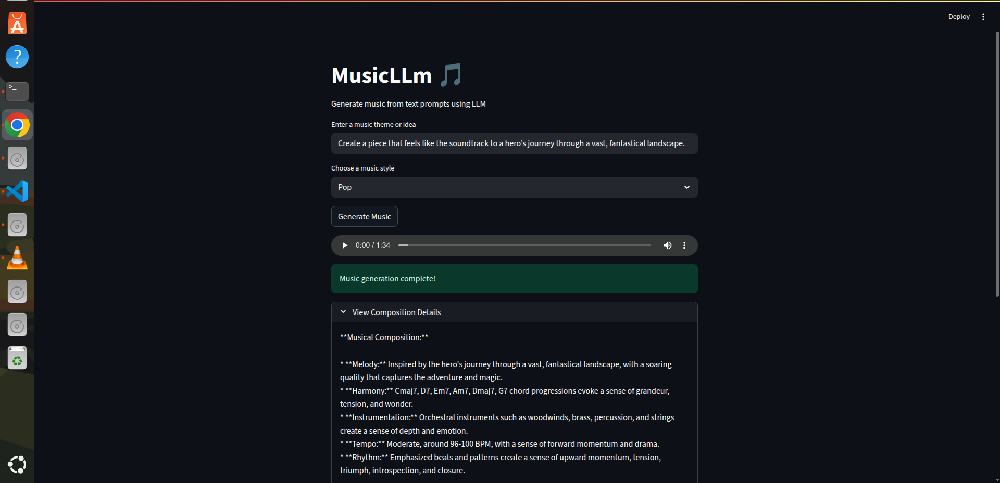
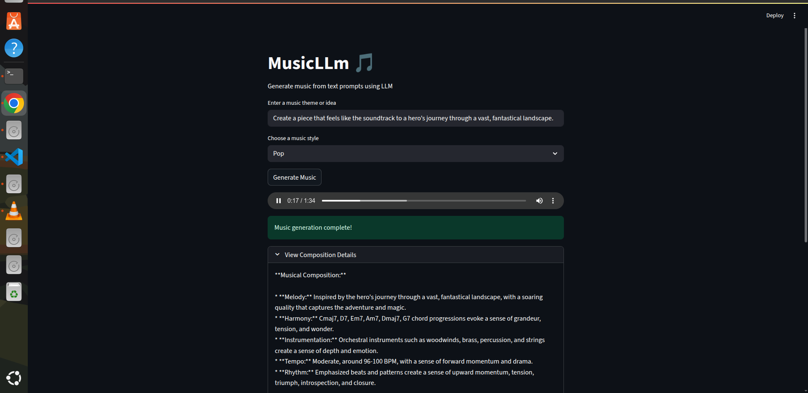
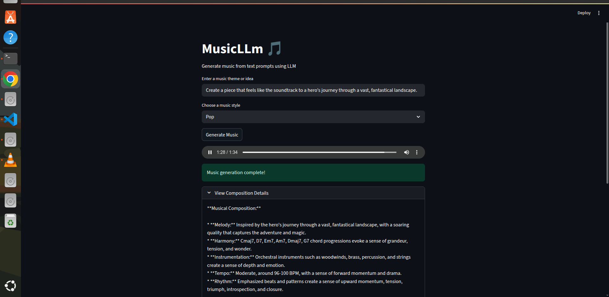
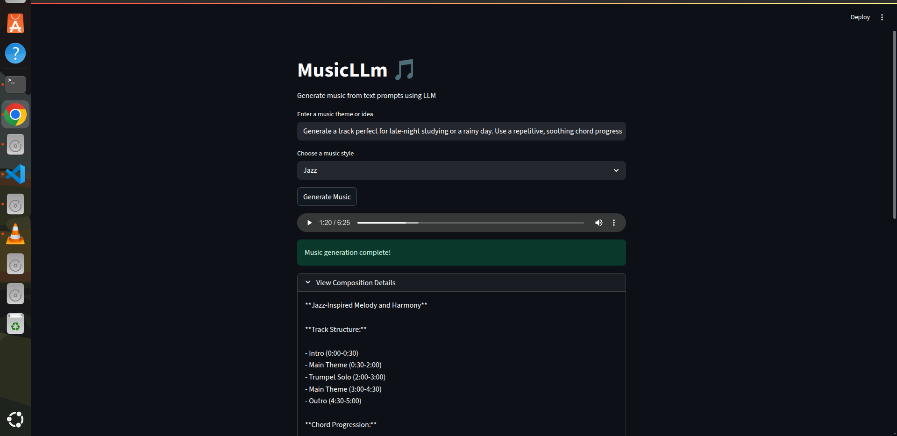
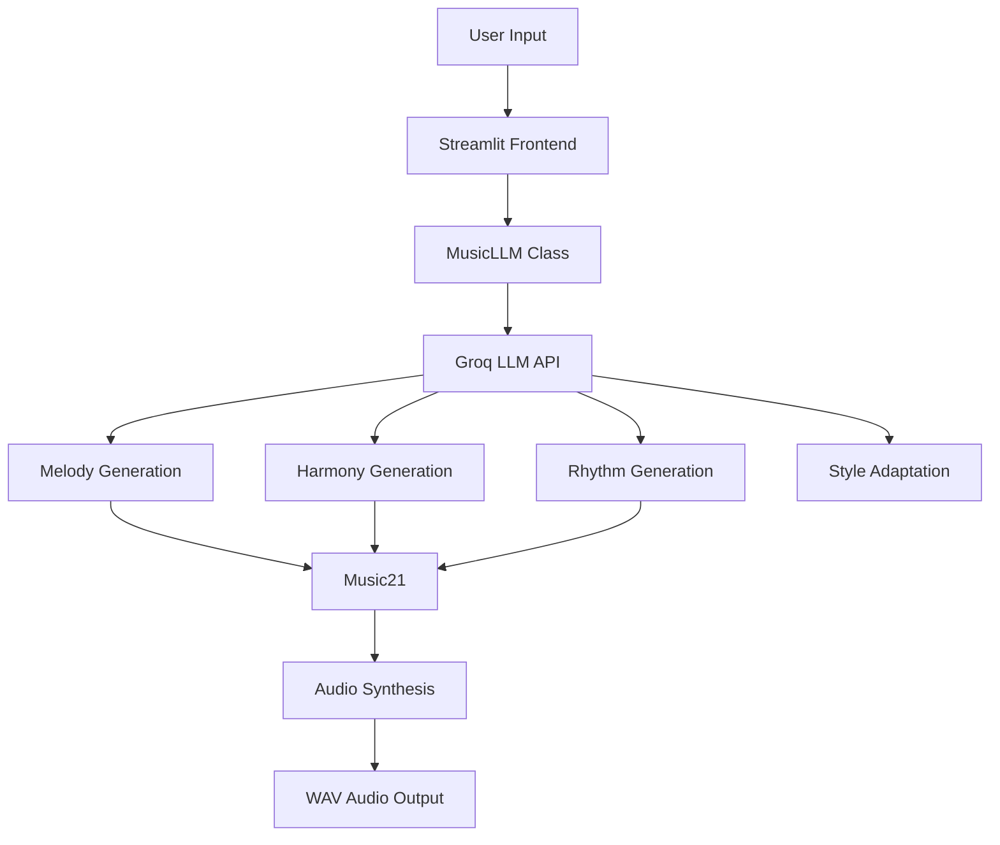

# Music Composer 🎵

An AI-powered music composition tool that generates melodies, harmonies, and rhythms from text prompts using Large Language Models (LLMs).

## Demo






## Table of Contents

- [Overview](#overview)
- [Features](#features)
- [Architecture](#architecture)
- [Demo](#demo)
- [Prerequisites](#prerequisites)
- [Installation](#installation)
- [Usage](#usage)
- [Deployment](#deployment)
  - [Docker](#docker)
  - [Kubernetes](#kubernetes)
  - [CI/CD Pipeline](#cicd-pipeline)
- [Project Structure](#project-structure)
- [Configuration](#configuration)
- [API Reference](#api-reference)
- [Contributing](#contributing)
- [License](#license)

## Overview

Music Composer is a Streamlit web application that leverages the power of LLMs to transform text descriptions into musical compositions. Users can input a theme or idea, select a musical style, and generate a unique musical piece complete with melody, harmony, and rhythm.

The application uses the Groq API with the Llama-3.1-8b-instant model to generate musical elements and converts them into playable audio using audio synthesis techniques.

## Features

- 🎵 **Text-to-Music Generation**: Convert text prompts into musical compositions
- **Multiple Music Styles**: Choose from Classical, Jazz, Rock, Pop, Blues, Electronic, and Romantic styles
- **Complete Composition**: Generates melody, harmony, and rhythm for a full musical experience
- 🔊 **Audio Playback**: Listen to generated compositions directly in the browser
- **Composition Details**: View detailed information about the generated music
- ☁️ **Cloud Deployment Ready**: Docker and Kubernetes deployment configurations included
- ⚡ **CI/CD Pipeline**: Automated deployment through GitLab CI/CD

## Architecture



## Demo


_Example of the Music Composer interface with generated audio playback_

## Prerequisites

- Python 3.11+
- Groq API Key
- Docker (for containerized deployment)
- Kubernetes cluster (for Kubernetes deployment)
- GitLab account (for CI/CD pipeline)

## Installation

1. Clone the repository:

   ```bash
   git clone https://github.com/1morshed1/Music-Composer.git
   cd Music-Composer
   ```

2. Install dependencies:

   ```bash
   pip install -r requirements.txt
   ```

3. Set up environment variables:
   Create a `.env` file in the project root with your Groq API key:

   ```env
   GROQ_API_KEY=your_groq_api_key_here
   ```

4. Run the application:
   ```bash
   streamlit run app.py
   ```

## Usage

1. Open your browser and navigate to `http://localhost:8501`
2. Enter a music theme or idea in the text input field
3. Select a music style from the dropdown menu
4. Click the "Generate Music" button
5. Listen to the generated composition using the audio player
6. Expand the "View Composition Details" section to see technical information about the music

Example prompts:

- "A peaceful morning in the countryside"
- "An intense battle scene"
- "Romantic sunset at the beach"
- "Jazz club in the 1920s"

## Deployment

### Docker

The application includes a Dockerfile for containerized deployment:

```bash
# Build the Docker image
docker build -t music-composer .

# Run the container
docker run -p 8501:8501 -e GROQ_API_KEY=your_api_key_here music-composer
```

### Kubernetes

A Kubernetes deployment configuration is included in `kubernetes-deployment.yaml`:

1. Update the Kubernetes deployment file with your container image and secrets:

   ```yaml
   # Update the image path and add your secrets
   image: your-registry/llmops-app:latest
   ```

2. Deploy to your Kubernetes cluster:
   ```bash
   kubectl apply -f kubernetes-deployment.yaml
   ```

### CI/CD Pipeline

The project includes a GitLab CI/CD pipeline configuration in `.gitlab-ci.yml` that automates:

- Code checkout
- Docker image building and pushing
- Kubernetes deployment

To use the CI/CD pipeline:

1. Set up a GitLab repository with this code
2. Configure the required environment variables in GitLab:
   - `GCP_SA_KEY`: Your Google Cloud service account key (base64 encoded)
3. Push changes to trigger the pipeline

## Project Structure

```
music-composer/
├── app/
│   ├── __init__.py
│   ├── main.py          # Core LLM music generation logic
│   └── utils.py         # Audio processing utilities
├── app.py               # Streamlit frontend application
├── requirements.txt     # Python dependencies
├── setup.py             # Package setup configuration
├── Dockerfile           # Docker configuration
├── kubernetes-deployment.yaml  # Kubernetes deployment config
├── .gitlab-ci.yml       # CI/CD pipeline configuration
├── .env                 # Environment variables (not in VCS)
└── .gitignore           # Git ignore rules
```

## Configuration

### Environment Variables

| Variable       | Description                      | Required |
| -------------- | -------------------------------- | -------- |
| `GROQ_API_KEY` | Your Groq API key for LLM access | Yes      |

### Application Parameters

In `app/main.py`, you can adjust:

- `temperature`: Controls the randomness of LLM outputs (default: 0.7)
- `model_name`: Specifies the LLM model to use (default: "llama-3.1-8b-instant")

## API Reference

### MusicLLM Class

The core functionality is encapsulated in the `MusicLLM` class:

```python
from app.main import MusicLLM

# Initialize the music generator
generator = MusicLLM(temperature=0.7)

# Generate a melody from text input
melody = generator.generate_melody("A peaceful morning")

# Generate harmony for a melody
harmony = generator.generate_harmony(melody)

# Generate rhythm for a melody
rhythm = generator.generate_rhythm(melody)

# Adapt the composition to a specific style
composition = generator.adapt_style("Classical", melody, harmony, rhythm)
```

### Methods

| Method               | Parameters                             | Description                                        |
| -------------------- | -------------------------------------- | -------------------------------------------------- |
| `generate_melody()`  | `user_input` (str)                     | Generates a melody based on text input             |
| `generate_harmony()` | `melody` (str)                         | Creates harmony chords for a melody                |
| `generate_rhythm()`  | `melody` (str)                         | Suggests rhythm durations for a melody             |
| `adapt_style()`      | `style`, `melody`, `harmony`, `rhythm` | Adapts the composition to a specific musical style |

## Contributing

Contributions are welcome! Please follow these steps:

1. Fork the repository
2. Create a new branch for your feature or bug fix
3. Commit your changes
4. Push to your branch
5. Create a pull request

---

Built with ❤️ using [Streamlit](https://streamlit.io/), [LangChain](https://www.langchain.com/), and [Groq](https://groq.com/)
